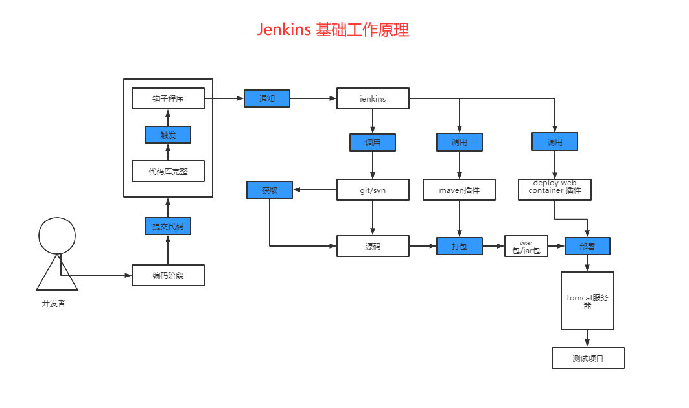
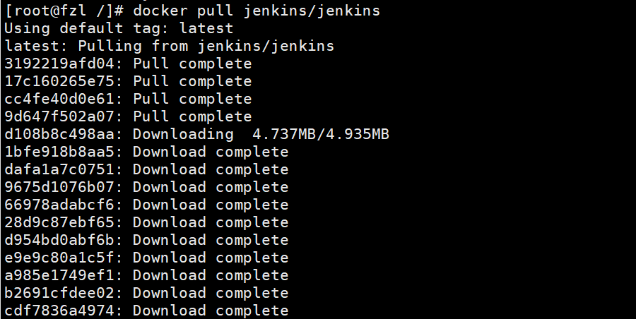
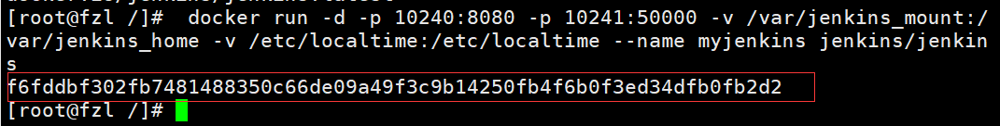
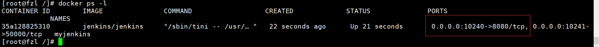
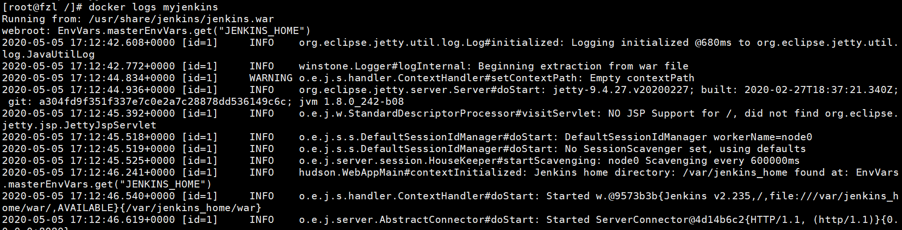
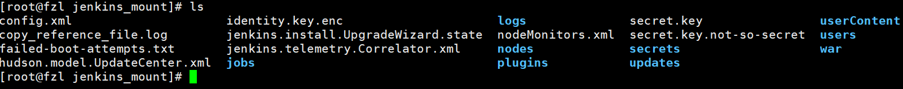
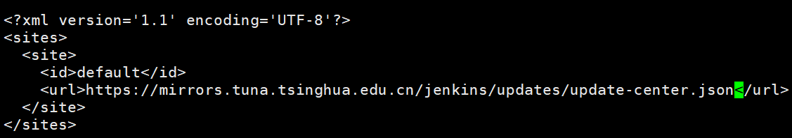
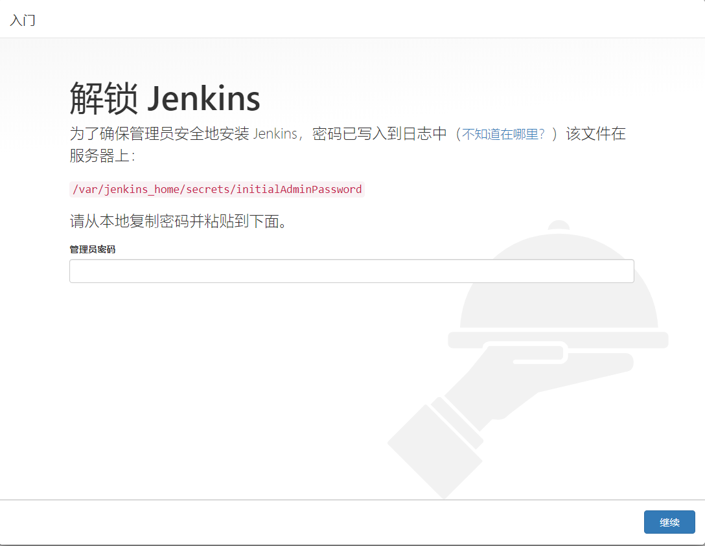
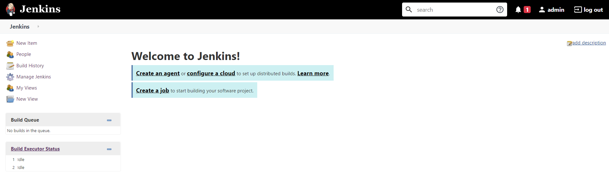

#  Jenkins 教程

# 1. 简介

## 1.1 介绍

> 　Jenkins是一个开源软件项目，是基于Java开发的一种持续集成工具，用于监控持续重复的工作，旨在提供一个开放易用的软件平台，使软件的持续集成变成可能。

我说下我以前开发的痛点，在一些中小型企业，每次开发一个项目完成后，需要打包部署，可能没有专门的运维人员，只能开发人员去把项目打成一个war包，可能这个项目已经上线了，需要把服务关，在部署到服务器上，将项目启动起来，这个时候可能某个用户正在操作某些功能上的东西，如果你隔三差五的部署一下，这样的话对用户的体验也不好，自己也是烦的很，总是打包拖到服务器上。希望小型企业工作人员学习一下，配置可能复杂，但是你配置好了之后，你只需要把代码提交到Git或者Svn上，自动构建部署，非常方便。有任何地方不懂的翻到最下方随时咨询我，想帮助更多的初学者共同一起努力成长！



## 1.2 环境准备


### 1.2.1 安装jenkins

安装docker

1.启动docker，下载Jenkins镜像文件

```
docker pull jenkins/jenkins
```




 2.创建Jenkins挂载目录并授权权限（我们在服务器上先创建一个jenkins工作目录 /var/jenkins_mount，赋予相应权限，稍后我们将jenkins容器目录挂载到这个目录上，这样我们就可以很方便地对容器内的配置文件进行修改。 如果我们不这样做，那么如果需要修改容器配置文件，将会有点麻烦，因为虽然我们可以使用docker exec -it --user root 容器id /bin/bash 命令进入容器目录，但是连简单的 vi命令都不能使用）

```
mkdir -p /var/jenkins_mount
chmod 777 /var/jenkins_mount
```

3.创建并启动Jenkins容器

> 　   -d 后台运行镜像
>
> 　　-p 10240:8080 将镜像的8080端口映射到服务器的10240端口。
>
> 　　-p 10241:50000 将镜像的50000端口映射到服务器的10241端口
>
> 　　-v /var/jenkins_mount:/var/jenkins_mount /var/jenkins_home目录为容器jenkins工作目录，我们将硬盘上的一个目录挂载到这个位置，方便后续更新镜像后继续使用原来的工作目录。这里我们设置的就是上面我们创建的 /var/jenkins_mount目录
>
> 　　-v /etc/localtime:/etc/localtime让容器使用和服务器同样的时间设置。
>
> 　　--name myjenkins 给容器起一个别名

```
docker run -d -p 10240:8080 -p 10241:50000 -v /var/jenkins_mount:/var/jenkins_home -v /etc/localtime:/etc/localtime --name myjenkins jenkins/jenkins
```

 



 

 4.查看jenkins是否启动成功，如下图出现端口号，就为启动成功了

```
docker ps -l
```

 



 5.查看docker容器日志。

```
docker logs myjenkins
```



 6.配置镜像加速，进入 cd /var/jenkins_mount/ 目录。

```
cd /var/jenkins_mount/
```



**修改 vi hudson.model.UpdateCenter.xml里的内容**

**修改前**


将 url 修改为 清华大学官方镜像：

~~~
https://mirrors.tuna.tsinghua.edu.cn/jenkins/updates/update-center.json
~~~

**修改后**




 7.访问Jenkins页面，输入你的ip加上10240



 

 8.管理员密码获取方法，编辑initialAdminPassword文件查看，把密码输入登录中的密码即可，开始使用。

```
vi /var/jenkins_mount/secrets/initialAdminPassword
```


 

 9.到此以全部安装成功，尽情的使用吧！



 


### 1.2.2 安装gitlab

#### 一、安装及配置

##### 1.gitlab镜像拉取


```ruby
# gitlab-ce为稳定版本，后面不填写版本则默认pull最新latest版本
$ docker pull gitlab/gitlab-ce
```


拉取镜像

##### 2.运行gitlab镜像


```csharp
docker run -d  -p 443:443 -p 80:80 -p 222:22 --name gitlab --restart always -v /home/gitlab/config:/etc/gitlab -v /home/gitlab/logs:/var/log/gitlab -v /home/gitlab/data:/var/opt/gitlab gitlab/gitlab-ce
# -d：后台运行
# -p：将容器内部端口向外映射
# --name：命名容器名称
# -v：将容器内数据文件夹或者日志、配置等文件夹挂载到宿主机指定目录
```

运行成功后出现一串字符串


运行成功

~~~bash
docker run -d  -p 443:443 -p 8088:80 -p 222:22 --name gitlab --restart always -v ~/gitlab/config:/etc/gitlab -v ~/gitlab/logs:/var/log/gitlab -v ~/gitlab/data:/var/opt/gitlab gitlab/gitlab-ce
~~~


##### 3.配置

按上面的方式，gitlab容器运行没问题，但在gitlab上创建项目的时候，生成项目的URL访问地址是按容器的hostname来生成的，也就是容器的id。作为gitlab服务器，我们需要一个固定的URL访问地址，于是需要配置gitlab.rb（宿主机路径：/home/gitlab/config/gitlab.rb）。


```ruby
# gitlab.rb文件内容默认全是注释
$ vim /home/gitlab/config/gitlab.rb
```


```ruby
# 配置http协议所使用的访问地址,不加端口号默认为80
external_url 'http://192.168.199.231'

# 配置ssh协议所使用的访问地址和端口
gitlab_rails['gitlab_ssh_host'] = '192.168.199.231'
gitlab_rails['gitlab_shell_ssh_port'] = 222 # 此端口是run时22端口映射的222端口
:wq #保存配置文件并退出
```


修改gitlab.rb文件


```ruby
# 重启gitlab容器
docker restart gitlab
```

此时项目的仓库地址就变了。如果ssh端口地址不是默认的22，就会加上ssh:// 协议头
 打开浏览器输入ip地址(因为我的gitlab端口为80，所以浏览器url不用输入端口号，如果端口号不是80，则打开为：ip:端口号)

##### 4.创建一个项目

第一次进入要输入新的root用户密码，设置好之后确定就行


gitlab页面

下面我们就可以新建一个项目了，点击Create a project


Create a project

创建完成后：


创建完成！

#### 二、用户使用

##### 1.下载git.exe

双击git.exe安装git（一直点下一步，直到完成）
 点击电脑桌面空白地方右键看到如下两行即安装成功


image.png

##### 2.登录gitlab网页

> **url**：http://192.168.1.111
>  填写账号密码登录


登录页面

##### 3.设置ssh

1.打开本地git bash,使用如下命令生成ssh公钥和私钥对


```ruby
$ ssh-keygen -t rsa -C 'xxx@xxx.com'
```

然后一路回车(-C 参数是你的邮箱地址)


生成密匙

2.然后输入命令：


```ruby
# ~表示用户目录，比如我的windows就是C:\Users\Administrator，并复制其中的内容
$ cat ~/.ssh/id_rsa.pub
```


公匙

3.打开gitlab,找到Profile Settings-->SSH Keys--->Add SSH Key,并把上一步中复制的内容粘贴到Key所对应的文本框


添加公匙到gitlab

##### 4.从gitlab克隆代码

1.回到gitlab页面点击projects->your projects


2.选择一个需要克隆的项目，进入


我的项目页面

3.点击按钮复制地址


复制ssh地址

4.新建一个文件夹，我在这里在我的电脑D盘下新建project文件夹


5.进入projects文件夹右键选择->Git Bash Here


点击Git Bash Here

6.设置用户名和邮箱


```csharp
$ git config --global user.name "你的名字"
$ git config --global user.email "你的邮箱"
```


设置名字和邮箱

7.克隆项目


```bash
$ git clone 项目地址
```


克隆项目

8.查看projects文件夹，项目已经克隆下来了


项目目录

##### 5.提交代码到gitlab

1.基于以上步骤，在克隆的项目文件夹下新增一个测试文件


新增txt文件

2.查看同步状态
 在项目文件夹下右键点击->Git Bash Here


输入


```ruby
$ git status
```


状态

可以看到红色部分有需要提交的文件
 3.提交代码
 输入


```csharp
$ git add  测试提交的文件.txt
```

(“git add“后加“.”则添加全部文件，也可以加"*.txt"表示添加全部需要提交的txt文件 )


add需要提交的文件

然后输入以下命令提交并添加提交信息


```ruby
$ git commit -m "message"
```


commit

最后输出以下命令提交到gitlab


```ruby
$ git push origin master
```


### 1.2.3 gitlab占用内存太多


修改/etc/gitlab/gitlab.rb

```
#2019-12-4 add by lishuo  start
unicorn['worker_processes'] = 4
#2019-12-4 add by lishuo end
 
 
#2019-12-4 add by lishuo  start
postgresql['max_worker_processes'] = 4
#2019-12-4 add by lishuo  end
 
 
#2019-12-4 add by lishuo  start
nginx['worker_processes'] = 4
#2019-12-4 add by lishuo  end
```

重新运行

```
gitlab-ctl reconfigure  #gitlab会读取配置文件参数并修改各个插件的配置文件去（我猜的）
 
gitlab-ctl restart
```